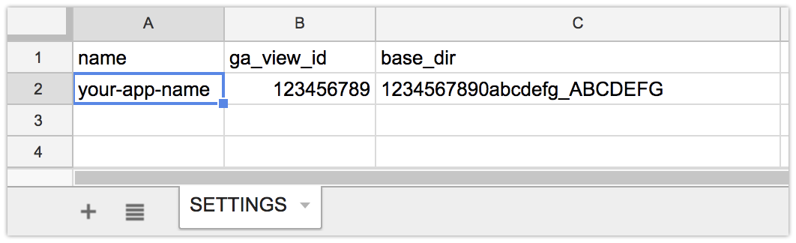

# RealtimeAURecorder

A Google Apps Script application to record realtime active users from Google Analytics.

This application has the following features,

- Recording the value of realtime active users
- Drawing line chart of recorded active users

## Dependencies

- Node.js 8.11 or later
- [google/clasp](https://github.com/google/clasp) 1.5.3 or later
- Google Sheets
- Google Analytics API

## How to install

1. Create a spreadsheet in your Google Drive as a container document.
2. Create a sheet named SETTINGS in the container spreadsheet.<br>
   SETTINGS sheet must have header row which consists of _name_, _ga_view_id_ and _base_dir_.
3. Clone [RealtimeAURecorder](https://github.com/HeRoMo/RealtimeAURecorder). and install npm packages.

```
$ git clone https://github.com/HeRoMo/RealtimeAURecorder.git
$ cd RealtimeAURecorder
$ npm install
```

4. Build and deploy

```bash
$ npm run login
$ npm run init_gas <the container spreadsheet ID>
$ npm run Build
$ npm run deploy
```

**Notice:** this scripts uses `clasp` command. see [google/clasp](https://github.com/google/clasp)

6. Open container spreadsheet, and open script editor, then run `setUp` function in _code.gs_.
7. Turn **ON** _Google Analytics API_ in Advanced Google services setting of the script and API console of Google Cloud.

## How to setting

1. Create a folder as _base_dir_ in your Google Drive, that is for creating spreadsheets to record realtime active users count.
2. Open the SETTINGS sheet.
3. Add a row to SETTINGS sheet.

- _name_ : your web site name
- _ga_view_id_ : Google Analytics view id of your web site.
- _base_dir_ : Google Drive folder id of your _base_dir_.

4. Test your setting.<br>
   Open script editor and exec `recordAUAll` function in _code.gs_.<br>
   if your setting is collect, a folder and a spreadsheet created in _base_dir_.
5. If you have another web site, add another row in the SETTINGS sheet.



## Record continuously

To record active users, you only run `recordAUAll` function in _code.gs_.<br>
To record active users continuously, you can use time-driven trigger.

1. Open script editor from the container spreadsheet.
2. From the script editor, choose **Edit > Current project's triggers**.
3. Click the link that says: **Click here to add one now**.
4. Under Run, select `recordAUAll` function.
5. Under Events, select **Time-driven**, and select **Minutes timer**, and then select **every 5 minutes**.

## Web interface

This application has web user interface, for showing the chart of active users count.

At first, you have to Deploy this scripts as a web app.

1. Open script editor from the container spreadsheet.
2. Select **Publish > Deploy as web app**.
3. Select _version_, _authorization_ and _access scope_.
4. Publish the web app.
5. Access your web app url.

## License

This scripts is released under the MIT License, see [LICENSE](./LICENSE.txt).
